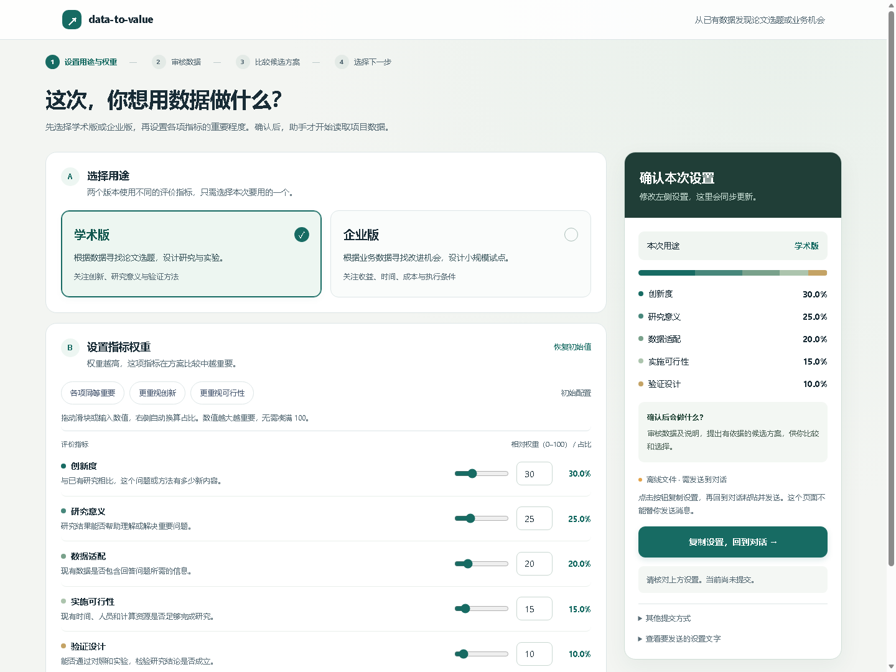

# data-to-value｜数据变选题 · 数据变方案

有数据集，不知道研究什么？有业务记录，不知道还能怎么用？

**从已有数据出发，发现论文选题或业务机会，比较依据、风险和投入，由你选择下一步。**

[下载安装包](https://github.com/sdjlkcnhv/data-to-value/releases/tag/v0.1.0) · [安装说明](INSTALL.md) · [体验样例](examples/README.md) · [支持范围](references/compatibility.md)

当前为私有调试包，下载需要获授权的 GitHub 账号；尚未在 SkillHub 公开上架。

## 适合哪些需求

| 你的需求 | 可以得到什么 |
|---|---|
| 有数据集，还没有论文选题 | 候选研究问题、已有工作比较、关键缺口和最小验证建议 |
| 有订单、日志或运营数据，想发现新用途 | 业务机会、可执行动作、时间与成本估算、试点建议 |
| 已有方案，想判断是否值得投入 | 数据与评价风险、修正办法、继续或停止的条件 |

## 如何工作

**① 选版本＋调权重 → ② 审核数据 → ③ 生成并比较方案 → ④ 由你选择。**

- 第一步同时确认学术版或企业版，以及各项评价指标的权重。
- 对照说明与实际数据，记录可用事实、冲突和读取范围。
- 从证据形成不同方向；每项说明价值来源、关键未知及最低成本的验证办法。
- 通常精选三个候选，按你的偏好评分比较；证据不足时少给，未知分项不编分数。
- 你选定方向后，再按需要继续验证、实施或写作。

| 学术版关注 | 企业版关注 |
|---|---|
| 创新度、研究意义、数据适配、实施可行性、验证设计 | 潜在净价值、见效时间、执行成本、落地条件、效果可测量性 |

## 看看实际界面

启动页实拍，示例选择不代表已向任务提交。下载并解压后可打开 [启动页](examples/start.html)、[学术比较演示](examples/academic-comparison.html) 和 [企业比较演示](examples/business-comparison.html)。比较演示使用合成数据与假设评分；GitHub 文件页通常只显示 HTML 源码。

## 开始使用

按 [安装说明](INSTALL.md) 导入完整技能包并完成一次环境初始化。随后上传数据和说明，发送：

> 使用 data-to-value，帮我从这些数据发现值得做的方向。先让我选择学术版或企业版并确认权重，再审核数据、比较候选，由我选择方案。

适用于电脑端数据工作流。CSV、Excel、JSON、Parquet、Word、文本 PDF 等按 [支持清单](references/data-formats.md) 读取；扫描件需选配 OCR。完整功能需要宿主提供文件读取与 Python 执行能力。页面展示和回传取决于宿主，不支持时在对话中完成选择；离线页面无需付费托管。

技能提供研究与业务判断的工作流程，不承诺论文录用或实际收益。实验、部署和收益均以实际完成的证据为准。

[MIT 许可](LICENSE) · [维护与检查](publishing/release-check.md)
