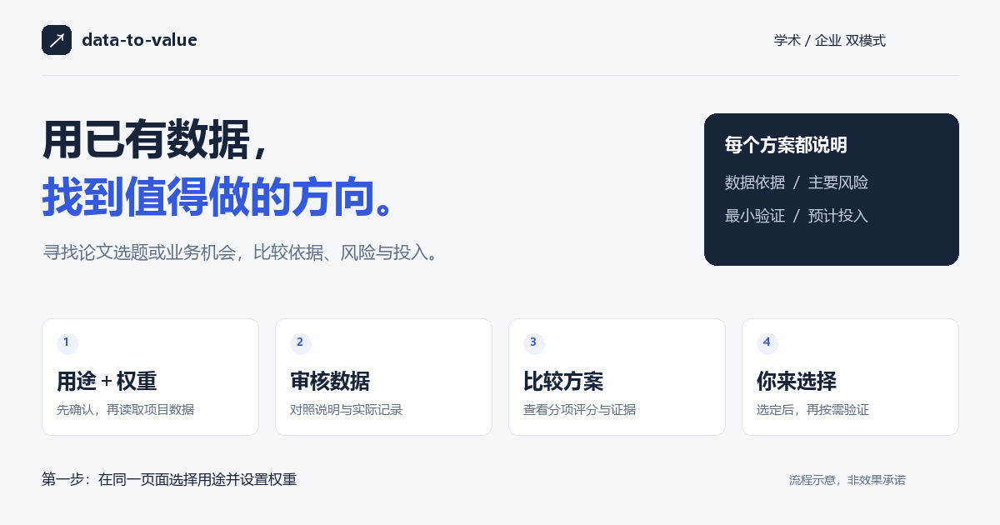

# data-to-value｜数据变选题 · 数据变方案

**有数据，不知道能做什么？从论文选题到业务机会，先找到值得验证的方向。**



上传已有数据和说明，在第一步同时选择学术版或企业版并设置权重。技能审核说明与实物，提出有依据的候选，用评分和可视化说明取舍，最后由你选择下一步。

[下载当前调试包](https://github.com/sdjlkcnhv/data-to-value/releases/tag/v0.1.0) · [安装说明](INSTALL.md) · [先看样例](examples/README.md) · [统一启动页](examples/start.html) · [支持范围](references/compatibility.md)

> 当前私有调试，下载需 GitHub 授权账号。直接覆盖同一安装包，不递增版本；`v0.1.0` 是固定下载入口。尚未在 SkillHub 公开上架。

## 你会得到什么

| 你现在的情况 | 技能帮你完成 | 第一份交付 |
|---|---|---|
| 有数据集，不知道写什么论文 | 发现可检验的研究问题，对照已有工作界定新增量 | 候选选题、证据与缺口、基线、最小实验 |
| 企业积累了数据，用途停留在报表 | 发现能改变业务动作的数据用途，比较成本与验证条件 | 业务机会、成本/周期估算、最小试点 |
| 已有想法，担心做不出来 | 审核数据、标签、信息时点和评价方法 | 风险清单、修正建议、去留条件 |

默认精选三个实质不同的候选；证据不足时少给，未知项不填造分数。先选方向，实验、工程和写作按你的请求继续。

## 复制一句话开始

安装完成后，上传数据与说明，再发送：

> 请使用 data-to-value。我有这些数据，但还没有想法。第一步让我同时选择学术版或企业版并确认权重，本轮先做到候选比较，由我选择方案。

已经知道用途，可以直接说：

**学术版**

> 使用 data-to-value，选择学术版。根据我上传的数据和说明找论文选题；先确认我的评价偏好，再审核数据。列出候选、创新性证据和最便宜的验证办法，等我选定后再做实验。

**企业版**

> 使用 data-to-value，选择企业版。这些订单和售后数据目前只用于报表。先确认偏好，再审核数据，找能改善业务动作的机会，比较执行成本、见效时间和验证条件，由我选方案。

没有准备数据也能先体验：[内置合成样例与两版页面](examples/README.md)。样例展示工作方式，不代表真实研究结论或收益。

## 和直接问大模型相比，多了哪些可检查的结果

| 容易遗漏的环节 | 这里明确交付什么 |
|---|---|
| 只相信数据说明 | 对照实际字段、单位、时间和记录，保留冲突与读取范围 |
| 给一串听起来不错的点子 | 每个想法连接具体事实、使用者、简单基线和可推翻它的试验 |
| 学术和企业混用同一套标准 | 学术比较创新度等；企业比较潜在净价值、时间、成本及落地条件 |
| 总分掩盖未知和硬伤 | 分项附依据；未知留空，阻断项不参与正式排名 |
| 模型替你决定或中断后从头来 | 你确认权重和主线，续作复用已有决定与证据 |

这些是技能约定和脚本检查带来的约束，不保证任意模型每次都遵守；目标宿主仍需实际验收。

## 一条清楚的工作链

**一次确认版本与权重 → 审核数据 → 生成候选 → 查新/比较现状 → 评分展示 → 你选方案 → 最小验证 → 按需实施与写作。**

两版同等支持；已有版本、权重和方案直接沿用。只做数据审核或审查既定方案时，不强制完成整条链。

| 学术版评分 | 企业版评分 |
|---|---|
| 创新度、研究意义、数据适配、实施可行性、验证设计 | 潜在净价值、见效时间、执行成本、落地条件、效果可测量性 |

偏好页和比较页可离线生成；若宿主不支持页面预览，就在对话中确认。完整分数需要完整证据，不承诺每个候选都有总分。

## 安装

### 作为 Agent Skill

把本目录放到宿主的技能根目录下，确保 `SKILL.md` 位于技能目录第一层：

```text
<技能根>/data-to-value/SKILL.md
```

常见技能根：`~/.dsh/skills`、`~/.claude/skills`、`~/.agents/skills`、项目内的 `.agents/skills`。

仓库当前为私有。下载Release附件或克隆均需已获授权的GitHub账号；不要把访问令牌粘贴到聊天。上传ZIP到技能导入入口，或使用已认证的Git克隆后放入宿主要求的技能目录。本项目尚未声明在SkillHub/ClawHub注册，不提供占位安装命令。

### 一次安装，后续复用

```text
python scripts/setup_environment.py --profile common --install
```

默认准备常用数据配置并逐项验证依赖和合成文件读取。命令由安装助手执行；不在每次上传数据时重复安装。现有环境通过检查就复用，缺少依赖才安装到专用虚拟环境。详细步骤见 [INSTALL.md](INSTALL.md)。导入ZIP是否自动触发初始化由宿主决定；本项目没有假定所有平台都提供安装钩子。

| 配置 | 用途 |
|---|---|
| core | 标准库、交互页面、CSV/JSON/文本/SQLite/ZIP清单 |
| tabular | core加pandas、NumPy、openpyxl |
| common（默认） | 常用Excel、列式数据、文档和结构化文本读取 |
| ocr（选配） | common加图片/扫描PDF识别；需额外准备Tesseract和目标语言数据 |

支持格式与边界见 [数据读取清单](references/data-formats.md)，按平台和格式记录的实测程度见 [兼容性矩阵](references/compatibility.md)。不宣称所有平台、任意数据或所有文件变体均可直接运行。

### 统一读取

```text
<已验收的Python> scripts/read_data.py --input <文件> --output <工作区>/读取结果.json
```

解释器取自 `runtime-common.json` 等配置回执。读取器不安装依赖、不修改源数据；记录抽样、表/页位置、失败原因。解析成功仍需对照数据说明审核，不能当作真实数据认证。

## 网页展示

两版交互页面使用Python标准库生成离线HTML。优先使用宿主交付/预览工具；本地桌面可请求浏览器打开。沙箱iframe可能限制JavaScript、剪贴板或回传，须实测；不支持时通过原生输入或对话确认，不把生成文件等同于页面已展示。

## 检查与测试

```text
python -m unittest discover -s tests -v
```

使用common配置解释器。测试覆盖格式读取、原文件不变、中文路径/控制台、依赖约束、部分读取与错误状态。提供Windows、Linux、macOS与Python 3.10/3.14的GitHub Actions矩阵模板（tests/compatibility-workflow.yml）；当前未启用，不能视为云端测试通过；不替代豆包等客户端账号内验收。

主要文件：`SKILL.md`为入口，`references/`包含按需细则；`scripts/setup_environment.py`负责安装验收，`read_data.py`负责统一读取，`configure_preferences.py`和`render_candidate_scores.py`负责交互页。`requirements-*.txt`声明不同配置的依赖，`tests/`提供回归测试。

## 许可

[MIT](LICENSE) © 2026 cytmustbeshine

## 页面是否需要付费维护

不需要网站托管费：设置页与比较页是技能生成或随包提供的离线HTML，不需要域名、服务器或第三方图表CDN。模型平台使用费、可选实验资源与人工维护不在此承诺范围内。

安装技能不会赋予宿主弹窗权限。支持原生表单就直接提交；支持HTML预览就展示本地页；都不支持就在同一条对话中选择版本并确认权重。无需外部网站也能完成第一步。普通浏览器可运行HTML，不等于任意模型聊天窗口都能自动弹出或回传。

### 填完能否直接交回助手

可以，前提是助手能在用户本机运行临时接收器：用 `configure_preferences.py --output <页面路径> --result <回执路径> --open` 启动，用户点“确认并继续”，设置就写入当前任务，助手读取后继续；无需复制、API Key或付费服务器。接收器仅监听127.0.0.1，确认后退出。普通聊天网页/远程沙箱不假定具备此能力，优先用原生表单或一次对话确认。

直接打开随包HTML是离线预览：页面不能自行关联当前对话或给模型发送消息。此时提供复制设置和保存设置文件两种方式，明确标注未自动提交。方案比较页目前仍通过对话确认选择，不声称它具备启动页的本机回传。
